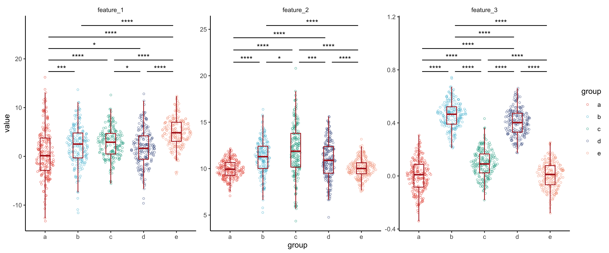
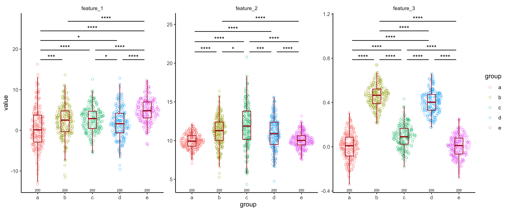

ggexp
================

Provides several plotting utilities to aid in performing exploratory
analysis with publication-quality figures.

## Key functions

  - `plot_pairwise_annotation`: Plot a pairwise annotation (such as the
    results of pairwise statistical tests) onto a plot with a discrete
    x-axis and continuous y-axis and automatically assign the tiers to
    minimize the number of tiers needed to plot the comparisons.
  - `plot_distributions`: Plot distributions with flexibility of quickly
    changing plot attributes in a one-liner.
  - `plot_pairwise_scatterplot`: Plot a pairwise scatterplot while
    simulatenously faceting based on other columns
    (`ggforce::facet_matrix` offers something similar now with even more
    functionality allowing discrete axes, but cannot facet on any
    variables except those to generate the x- and y-axes).
  - `plot_barplot`: Plot a barplot with annotations and easily switch
    between stacked, unstacked and adjust text annotations accordingly.
  - `theme_ggexp`: Variation on `ggplot2::theme_classic` with a blank
    strip background for facets.
  - `get_palette`: Generate consistent and ordered palettes based on
    palettes from `ggsci`.

### `plot_pairwise_annotation`

We generate some data with data sampled from a Gaussian with known mean
and std dev. This consists of a total of 5 groups to compare across for
a total of 3 features. For each of these features, we compute the
p-values for pairwise Wilcoxon rank-sum test, and annotate these
comparisons on a `geom_sina` plot.

``` r
library(ggexp)
library(ggplot2)
library(magrittr)

set.seed(1234)

data = data.frame(
  "feature" = rep(c("feature_1", "feature_2", "feature_3"), each = 1000),
  "value" = c(
    c(
      rnorm(200, 1, 5),
      rnorm(200, 2, 4),
      rnorm(200, 3, 3),
      rnorm(200, 2, 4),
      rnorm(200, 5, 3)
    ),
    c(
      rnorm(200, 10, 1),
      rnorm(200, 11, 2),
      rnorm(200, 12, 3),
      rnorm(200, 11, 2),
      rnorm(200, 10, 1)
    ),
    c(
      rnorm(200, 0, .11),
      rnorm(200, .45, .1),
      rnorm(200, .10, .11),
      rnorm(200, .4, .1),
      rnorm(200, 0, .1)
    )
  ),
  "group" = rep(rep(c("a", "b", "c", "d", "e"), each = 200), 3),
  "id" = rep(1:200, 15)
)

wilcox_results = data %>%
  tidyr::nest(-feature) %>%
  dplyr::mutate(test = purrr::map(data, ~ as.data.frame(rstatix::wilcox_test(.x, value ~ group)))) %>%
  dplyr::select(feature, test) %>%
  tidyr::unnest(test)

plot = ggplot(data, aes(x = group, y = value, color = group)) +
  ggbeeswarm::geom_quasirandom(shape = 1, size = 1, alpha = 0.5) +
  geom_boxplot(alpha = 0, width = 0.3, outlier.size = 0, position = position_dodge(width = 1)) +
  facet_wrap(~feature, scales = "free") +
  ggexp::theme_ggexp() +
  ggexp::get_palette()

plot_pairwise_annotation(plot = plot, pairwise_annotation = wilcox_results, label = "p.adj.signif", values_to_exclude = "ns", tier_width = 0.08)
```

<!-- -->

### `plot_distributions`

This function creates very similar plots to the example shown above, but
in a more convenient way by providing a single function call. It also
includes a few additional useful features, such as annotating counts. We
will recreate a similar plot as above using this, in a single function
call.

``` r
plot_distributions(data = data,
                   pairwise_annotation = wilcox_results,
                   x = "group",
                   y = "value",
                   color = "group",
                   pairwise_annotation_label = "p.adj.signif",
                   pairwise_annotation_exclude = "ns",
                   facet_columns = "feature",
                   tier_width = 0.08)
```

<!-- -->
